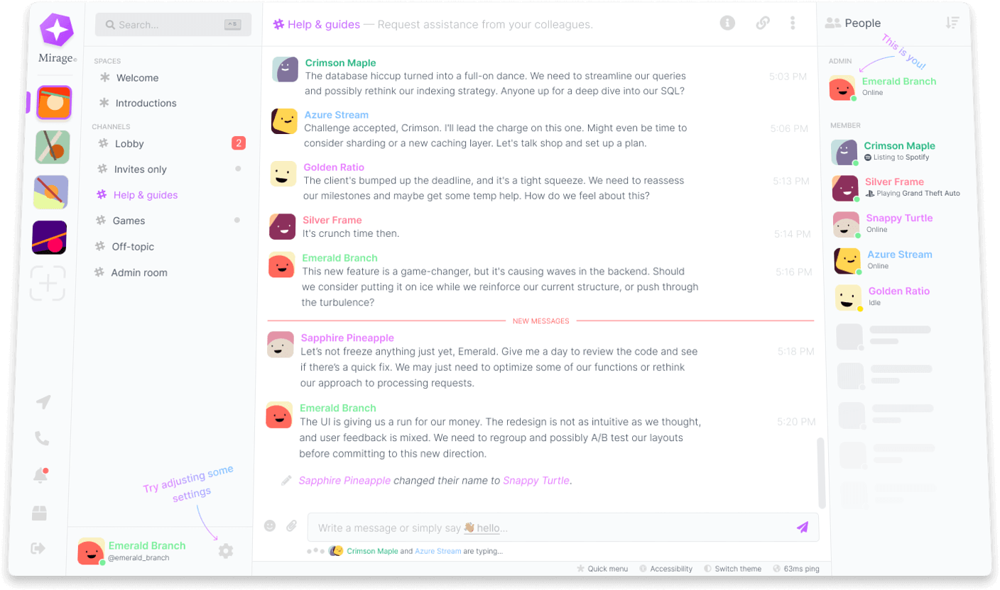

<div align="center">
  
  <br />
  <br />
  
  <p>A simple, lightweight, and easy-to-use web client for the <a href="https://matrix.org">[Matrix] protocol</a>.</p>
</div>

🎯 **Goal:** Create a seamless and intuitive web-based client for the \[Matrix\] protocol, that is feature-complete and customizable.

## Principles

* 📐 **Simple & consistent UI**: Maintain a clean interface that is consistent in its design, and emphasizes simplicity.
* ⚡ **Feature-complete**: Make all the features that the Matrix protocol has to offer, available to the user, whilst not polluting the UI or overwhelming the user.
* ✨ **Customizable**: Empower the user to customize the UI to their liking (including fonts and colors), enabling the creation of themes for a more personalized experience.

## Building and running

### Prerequisites

* [Node.js](https://nodejs.org/en)
* [Yarn (optional)](https://yarnpkg.com/)

### Building & running locally

```bash
npm install
npm run dev
```

## Technology Stack

* **Programming language**:
  * [TypeScript](https://www.typescriptlang.org/)
* **User-interface**:
  * [React](https://reactjs.org/)
  * [SCSS/SASS](https://sass-lang.com/)
  * [Tippy.js](https://atomiks.github.io/tippyjs/): Tooltip library for React
* **Additional tooling & frameworks**:
  * [Matrix JS SDK](https://github.com/matrix-org/matrix-js-sdk): Matrix client library
  * [Vite.js](https://vitejs.dev/): Build tooling
  * [Boring Avatars](https://github.com/boringdesigners/boring-avatars): Avatar generator
  * [DayJS](https://day.js.org/): Date & time formatting library
  * [Zustand](https://github.com/pmndrs/zustand): React state-management library
  * [Storybook.js](https://storybook.js.org/): Isolated component development environment

<hr />
<div align="center">
  <i>
    Please feel free to reach out to me on <a href="https://www.linkedin.com/in/yurixander/">LinkedIn</a> for business inquiries.<br />
    Images generated with DALL·E 3, and edited with Figma.<br />
    &copy; 2023 Yurixander Ricardo<br /><br />
    
  </i>
</div>
